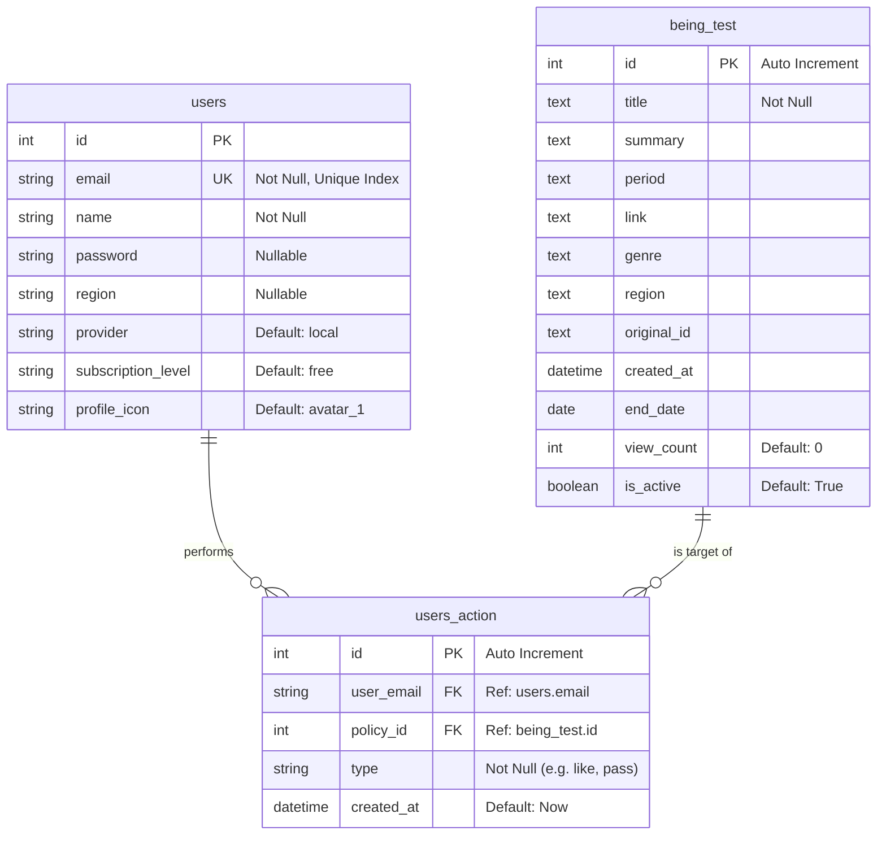

# Entity Relationship Diagram (ERD)

## Overview
This document describes the database schema for the **Being Geul** application. The database is **PostgreSQL**, and the connection settings are managed via the `.env` file (referenced by `database.py`).

## Database Connection
The application uses **SQLAlchemy** to connect to the database. The connection URL is constructed using environment variables:
`postgresql://{DB_USER}:{DB_PASSWORD}@{DB_HOST}:{DB_PORT}/{DB_NAME}`

## ER Diagram (Mermaid)

## Table Descriptions

### 1. `users`
Stores user account information.
- **Key Fields**: `email` (Unique Identifier), `provider` (Login method), `subscription_level` (User tier).
- **Relations**: Referenced by `users_action` via `email`.

### 2. `being_test` (Policies)
The main table storing youth policy information.
- **Key Fields**: `category` (genre), `region`, `end_date`.
- **Relations**: Referenced by `users_action` via `id`.

### 3. `users_action`
A log of user interactions with policies.
- **Purpose**: Tracks 'likes' (swipes right) or 'passes' (swipes left).
- **Logic**: Used for building the "My Liked Policies" list and recommendation logic.
