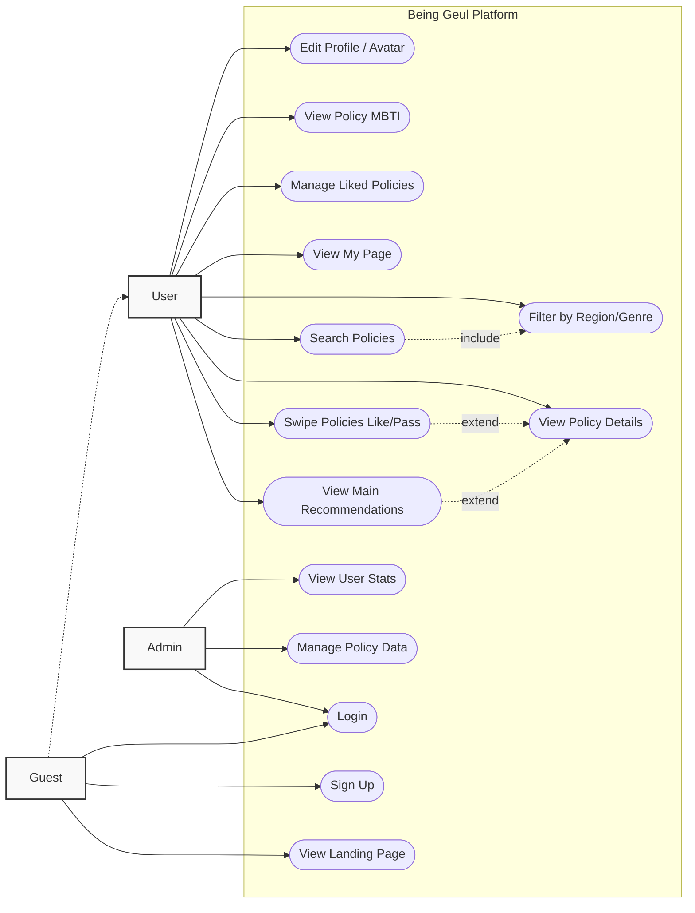

# System Use Case Diagram

## Overview
This document illustrates the primary use cases for the **Being Geul Youth Policy Platform**, showing how different actors interact with the system's features.

## Actors
1. **Guest**: A visitor who has not logged in.
2. **User**: A focused, logged-in member seeking youth policies.
3. **Admin**: A system administrator managing the platform content.

## Use Case Diagram (Mermaid)

## Key Workflows

### 1. Policy Discovery (Main Loop)
- **Actor**: User
- **Flow**: User logs in -> Views Main Page -> Swipes Cards (Like/Pass) -> Clicks for Detail -> System updates preferences.

### 2. Personalized Dashboard (My Page)
- **Actor**: User
- **Flow**: User accesses My Page -> Checks MBTI Type -> Reviews "Liked" Policies -> Updates Profile Avatar.
